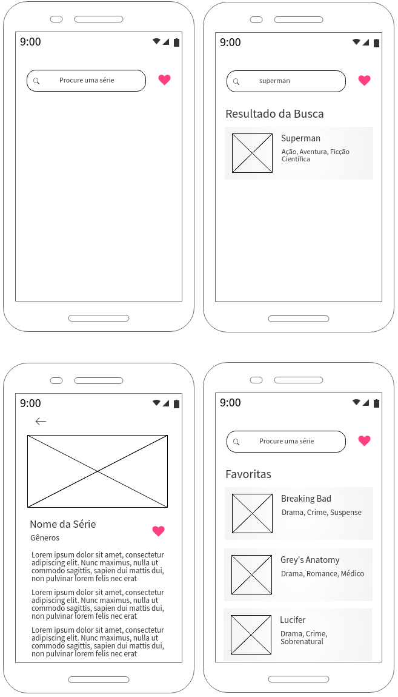
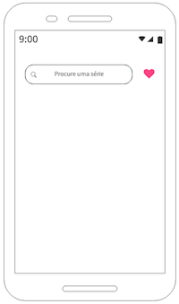
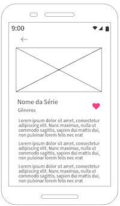

# Tutorial React Native

O objetivo deste tutorial é guiar você nos primeiros passos com o React Native. 

Vamos construir um aplicativo utilizando a [API TV Maze](https://www.tvmaze.com/api) e seguindo o protótipo abaixo:

## Como será o aplicativo?

Antes de começar a escrever código, é importante entender os comportamentos associados a cada tela.

### Tela inicial

Esta é a tela que o usuário visualizará ao iniciar o aplicativo.

Ela deverá ter uma barra de busca e, do lado direito da barra, um botão.

A barra de busca deverá ter um placeholder. Ao digitar uma palavra para ser buscada, devemos utilizar o botão que o teclado disponibilizar para iniciar a busca, por exemplo, como o que ocorre quando digitamos uma URL no navegador do celular.

Encontrando resultados, deverão ser exibidos abaixo da barra de busca e abaixo do título "Resultado da Busca", um por linha. Caso não obtenha nenhum resultado, deverá exibir a mensagem "Nenhum resultado encontrado".

Os resultados deverão ser exibidos como "cards" contendo a imagem, o nome da série e os gêneros atribuídos a ela.

Quando o usuário selecionar um dos resultados, deverá ser levado a uma outra tela que mostrará as informações completas da série. Descreveremos essa tela em breve.

O botão à direita da barra de busca, ao ser clicado, deverá mostrar as séries preferidas do usuário abaixo do título "Favoritas".

Se não houver busca em andamento, não exibir nada na tela.

Se não houver nenhuma série favoritada, exibir a mensagem "Você ainda não tem séries favoritas".

### Tela de detalhes da série

Quando o usuário clicar em uma série, seja nos resultados da busca ou nas favoritadas, deverá ser levado para a seguinte tela:

Esta tela deverá mostrar uma imagem associada à série, o nome, os gêneros e o sumário.

Ao lado do nome e dos gêneros, deverá ter uma botão para que o usuário possa favoritar a série. 

Quando o usuário clicar no botão para favoritar a série, os dados deverão ser salvos no armazenamento global interno do aplicativo (AsyncStorage) e deverá existir algum retorno visual para o usuário.

Acima da imagem da série, deverá ter um botão de voltar que levará para a tela anterior.
